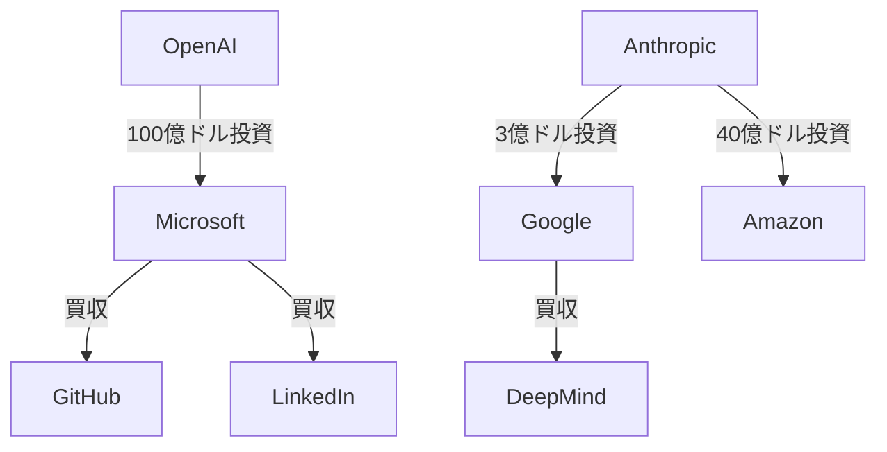

# 生成AI企業 横断比較分析

最終更新: 2024年XX月XX日

---

## 1. 基本情報比較

| 項目 | OpenAI | Anthropic | Google | Microsoft |
|------|--------|-----------|--------|-----------|
| **設立年** | 2015年 | 2021年 | 1998年 | 1975年 |
| **本社** | サンフランシスコ | サンフランシスコ | マウンテンビュー | レドモンド |
| **CEO** | Sam Altman | Dario Amodei | Sundar Pichai | Satya Nadella |
| **企業形態** | 営利+非営利 | 営利企業 | 上場企業 | 上場企業 |
| **主要投資家** | Microsoft | Google, Amazon | - | - |
| **従業員数** | ~1,500人 | ~500人 | ~180,000人 | ~220,000人 |

---

## 2. ミッション・ビジョン比較

### OpenAI
- **焦点**: AGI（人工汎用知能）の実現
- **理念**: 全人類への恩恵
- **アプローチ**: 段階的リリース、安全性重視

### Anthropic
- **焦点**: AI安全性の確保
- **理念**: 安全で理解可能なAI
- **アプローチ**: Constitutional AI、慎重な開発

### Google
- **焦点**: 情報の整理とアクセス
- **理念**: AI-first企業への転換
- **アプローチ**: 既存サービスへのAI統合

### Microsoft
- **焦点**: 生産性の向上
- **理念**: 人と組織の能力拡張
- **アプローチ**: エンタープライズ市場への統合

---

## 3. 収益モデル比較

| 収益源 | OpenAI | Anthropic | Google | Microsoft |
|--------|--------|-----------|--------|-----------|
| **API課金** | ✅ 主要収益 | ✅ 主要収益 | ✅ 一部 | ✅ 一部 |
| **サブスク** | ✅ ChatGPT Plus | ✅ Claude Pro | ❌ | ✅ Copilot Pro |
| **B2B契約** | ✅ Enterprise | ✅ for Work | ✅ Cloud AI | ✅ Azure OpenAI |
| **広告収入** | ❌ | ❌ | ✅ 主要収益 | ❌ |
| **クラウド** | ❌ | ❌ | ✅ GCP | ✅ Azure |
| **従来事業** | ❌ | ❌ | ✅ 検索・YouTube | ✅ Office・Windows |

### 収益化戦略の特徴

- **OpenAI**: AI特化の直接収益化
- **Anthropic**: 安全性プレミアム戦略
- **Google**: 既存事業へのAI統合による付加価値
- **Microsoft**: エンタープライズ向けAI統合

---

## 4. 主要製品・技術比較

| 分野 | OpenAI | Anthropic | Google | Microsoft |
|------|--------|-----------|--------|-----------|
| **LLM** | GPT-4, GPT-3.5 | Claude 3 | Gemini | GPT-4 (提携) |
| **対話AI** | ChatGPT | Claude | Bard/Gemini | Copilot |
| **画像生成** | DALL-E 3 | ❌ | Imagen | Designer |
| **音声** | Whisper | ❌ | ❌ | Speech Services |
| **コード** | Codex | ❌ | Codey | GitHub Copilot |
| **API** | OpenAI API | Anthropic API | Gemini API | Azure OpenAI |
| **プラットフォーム** | ❌ | ❌ | Vertex AI | Azure ML |

---

## 5. 戦略的立ち位置比較

### 技術開発アプローチ

| 企業 | 開発方針 | 特徴 | 強み |
|------|----------|------|------|
| **OpenAI** | AGI特化 | 段階的リリース | 先行者優位 |
| **Anthropic** | 安全性重視 | Constitutional AI | 信頼性・安全性 |
| **Google** | 統合・スケール | 既存サービス活用 | データ・インフラ |
| **Microsoft** | エンタープライズ | B2B特化 | 企業顧客基盤 |

### 競合優位性

**OpenAI**
- ✅ 先行者優位とブランド力
- ✅ AGI研究のリーダーシップ
- ❌ 資金調達・インフラ依存

**Anthropic**
- ✅ 安全性技術の独自性
- ✅ 学術的信頼性
- ❌ 市場シェアの小ささ

**Google**
- ✅ 豊富なデータとインフラ
- ✅ 基盤技術（Transformer）
- ❌ 規制リスク

**Microsoft**
- ✅ エンタープライズ市場の強さ
- ✅ OpenAI提携による先行
- ❌ OpenAI依存のリスク

---

## 6. 投資・提携関係

### 主要提携・投資

- **Microsoft ⇔ OpenAI**: 戦略的パートナーシップ
- **Google → Anthropic**: 投資・クラウド提携
- **Amazon → Anthropic**: 大規模投資・AWS統合
- **Google ← DeepMind**: 完全子会社化

---

## 7. 市場戦略比較

### ターゲット市場

| 企業 | B2C | B2B | 開発者 | エンタープライズ |
|------|-----|-----|--------|------------------|
| **OpenAI** | ✅✅ | ✅ | ✅✅ | ✅ |
| **Anthropic** | ✅ | ✅ | ✅ | ✅ |
| **Google** | ✅✅ | ✅ | ✅✅ | ✅ |
| **Microsoft** | ✅ | ✅✅ | ✅ | ✅✅ |

### 価格戦略

- **OpenAI**: プレミアム価格、従量課金
- **Anthropic**: 安全性プレミアム
- **Google**: 競争価格、既存サービス統合
- **Microsoft**: エンタープライズ価格、バンドル戦略

---

## 8. 技術的差別化要因

### OpenAI
- **AGI研究**: 最先端のAGI開発
- **スケーラビリティ**: 大規模モデルの訓練
- **ユーザビリティ**: 直感的なインターフェース

### Anthropic
- **Constitutional AI**: 価値観整合性技術
- **安全性研究**: 解釈可能性・制御可能性
- **学術性**: 研究論文の質と量

### Google
- **基盤技術**: Transformer、TPU
- **データ**: 検索・YouTube等の豊富なデータ
- **インフラ**: 世界規模のクラウドインフラ

### Microsoft
- **統合性**: 既存製品への自然な統合
- **エンタープライズ**: セキュリティ・コンプライアンス
- **エコシステム**: 開発者ツールとの連携

---

## 9. 将来展望比較

### 短期（1-2年）

| 企業 | 予想される展開 |
|------|----------------|
| **OpenAI** | GPT-5開発、マルチモーダル強化 |
| **Anthropic** | Claude 4、企業市場拡大 |
| **Google** | 検索AI統合、Gemini強化 |
| **Microsoft** | Copilot拡張、Azure統合深化 |

### 中期（3-5年）

- **OpenAI**: AGI実現への道筋、新たな収益モデル
- **Anthropic**: AI安全性のデファクトスタンダード
- **Google**: AI-first企業への完全転換
- **Microsoft**: エンタープライズAIの完全統合

### 長期（5年以上）

- **AGI実現競争**の激化
- **規制対応**の重要性増大
- **新たな技術パラダイム**の出現可能性
- **社会インフラ**としてのAI定着

---

## 10. リスク・課題比較

| リスク要因 | OpenAI | Anthropic | Google | Microsoft |
|------------|--------|-----------|--------|-----------|
| **技術的リスク** | AGI実現困難 | 商業化遅れ | 競合追い上げ | OpenAI依存 |
| **ビジネスリスク** | 収益化困難 | シェア拡大困難 | 規制対応 | 投資回収困難 |
| **競合リスク** | 大手参入 | 差別化困難 | 新興企業 | 独自技術不足 |
| **規制リスク** | AI安全性 | 研究制約 | 独占禁止 | データ保護 |

---

## 11. 分析サマリー

### 各社の戦略的特徴

1. **OpenAI**: AGI実現を目指すピュアプレイヤー
2. **Anthropic**: 安全性重視の研究開発型企業
3. **Google**: 既存事業統合による総合AI企業
4. **Microsoft**: エンタープライズ特化のAI統合企業

### 成功要因

- **技術力**: 独自技術の開発・維持
- **資金力**: 大規模投資の継続
- **顧客基盤**: 既存顧客への展開
- **パートナーシップ**: 戦略的提携の活用

### 今後の注目点

- **AGI実現**に向けた技術競争
- **規制対応**と社会的責任
- **収益性**の確保と持続可能性
- **新たな応用分野**の開拓

---

*この比較分析は定期的に更新され、最新の市場動向を反映します。* 