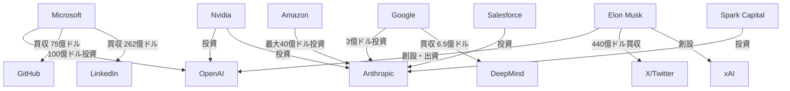

# 生成AI企業 関係性マップ

最終更新: 2024年XX月XX日

---

## 1. 投資・資本関係

### 主要投資関係図

### 詳細投資関係

#### Microsoft ⇔ OpenAI
- **2019年**: 10億ドル初回投資
- **2021年**: 追加投資（金額非公開）
- **2023年**: 100億ドル大型投資
- **関係性**: 独占的パートナーシップ
- **条件**: Azure独占提供、収益分配

#### Google → Anthropic
- **2022年**: 3億ドル投資
- **関係性**: 戦略的投資、競合牽制
- **条件**: Google Cloud優先利用

#### Amazon → Anthropic
- **2023年**: 最大40億ドル投資
- **関係性**: AWS統合、OpenAI対抗
- **条件**: AWS Bedrock独占統合

---

## 2. 協業・提携関係

### 技術提携

| 企業A | 企業B | 提携内容 | 開始年 | 状況 |
|-------|-------|----------|--------|------|
| Microsoft | OpenAI | Azure独占提供 | 2019 | 継続中 |
| Google | Anthropic | Cloud統合 | 2022 | 継続中 |
| Amazon | Anthropic | Bedrock統合 | 2023 | 継続中 |
| Apple | OpenAI | Siri統合検討 | 2024 | 交渉中 |
| Meta | Microsoft | Llama商用化 | 2023 | 継続中 |

### 研究協力
- **Google ⇔ 学術機関**: 多数の共同研究
- **Microsoft ⇔ 大学**: AI研究支援プログラム
- **OpenAI ⇔ 研究機関**: 安全性研究協力
- **Anthropic ⇔ 大学**: Constitutional AI研究

---

## 3. 競合・対立関係

### 直接競合

#### OpenAI vs Google
- **市場**: 対話AI、API市場
- **製品**: ChatGPT vs Bard/Gemini
- **差別化**: AGI志向 vs 統合戦略

#### Microsoft vs Google
- **市場**: クラウドAI、エンタープライズ
- **製品**: Copilot vs Workspace AI
- **差別化**: OpenAI提携 vs 自社技術

#### Anthropic vs OpenAI
- **市場**: 安全なAI、API市場
- **製品**: Claude vs ChatGPT
- **差別化**: 安全性重視 vs 性能重視

### 間接競合
- **xAI vs 全社**: 反既存AI企業の立場
- **中国企業 vs 米国企業**: 地政学的競争
- **Meta vs 全社**: オープンソース戦略

---

## 4. 法的係争・訴訟

### 進行中の主要訴訟

#### OpenAI関連訴訟
1. **Elon Musk vs OpenAI** (2024年)
   - **争点**: 非営利から営利への転換
   - **主張**: 創設時の約束違反
   - **現状**: 係争中

2. **著作権侵害集団訴訟**
   - **原告**: 作家・出版社グループ
   - **争点**: 無断学習データ使用
   - **現状**: 複数件係争中

#### Anthropic関連訴訟
1. **フェアユース訴訟** (2024年)
   - **争点**: 学習データのフェアユース適用
   - **重要性**: 業界全体への影響
   - **Anthropicの立場**: フェアユース主張

#### Google関連訴訟
1. **独占禁止法違反**
   - **争点**: 検索市場独占
   - **AI関連**: AI統合による独占強化懸念
   - **現状**: 複数の司法管轄で係争中

### 著作権・知的財産権問題
- **学習データ**: 著作権保護コンテンツの無断使用
- **フェアユース**: 教育・研究目的の例外適用
- **国際的差異**: 各国の著作権法の違い

---

## 5. 人材移動・引き抜き

### 主要人材移動

#### OpenAI関連
- **2023年**: Sam Altman一時解任→復帰騒動
- **流出先**: Anthropic、Google、Microsoft
- **引き抜き**: 研究者の高額引き抜き合戦

#### Anthropic創設
- **2021年**: 元OpenAI研究者による創設
- **主要メンバー**: Dario Amodei（元OpenAI VP）
- **技術継承**: Constitutional AI技術開発

#### Google DeepMind統合
- **2023年**: DeepMind と Google AI統合
- **人材統合**: 重複排除と効率化
- **技術統合**: Gemini開発体制強化

### 人材獲得競争
- **年収水準**: AI研究者の年収高騰
- **ストックオプション**: 将来価値への期待
- **研究環境**: 最先端設備・データアクセス
- **自由度**: 研究テーマの選択自由

---

## 6. 規制・政府関係

### 米国政府との関係

#### OpenAI
- **NIST**: AI安全性ガイドライン協力
- **国防総省**: 軍事利用の議論
- **議会**: CEO証言・規制議論

#### Google
- **独占禁止法**: 司法省との係争
- **データプライバシー**: FTC調査
- **AI規制**: 業界標準策定参加

#### Microsoft
- **政府調達**: Azure政府契約
- **セキュリティ**: 国家安全保障協力
- **規制対応**: 積極的な政府対話

### 国際的な規制対応
- **EU AI Act**: 欧州での事業展開
- **中国規制**: 市場アクセス制限
- **日本**: AI戦略への参画

---

## 7. 業界エコシステム

### チップ・インフラ依存
- **Nvidia**: 全社がGPUに依存
- **クラウド**: AWS、Azure、GCP競争
- **データセンター**: 地理的分散の必要性

### スタートアップ投資
- **OpenAI**: AI関連スタートアップ投資
- **Google Ventures**: AI分野への投資
- **Microsoft Ventures**: エコシステム構築
- **Anthropic**: 研究特化投資

### 学術界との関係
- **論文発表**: 研究成果の公開競争
- **人材交流**: 大学との人材交流
- **研究資金**: 大学研究室への支援

---

## 8. 将来の関係性予測

### 統合・買収の可能性
- **規制強化**: 大型買収の困難化
- **技術統合**: 垂直統合の必要性
- **新興企業**: スタートアップ買収継続

### 新たな対立軸
- **AI安全性**: 規制対応での対立
- **データアクセス**: 学習データ確保競争
- **国際展開**: 地政学的制約

### 協力の必要性
- **標準化**: 業界標準の策定
- **安全性**: 共通の安全基準
- **規制対応**: 政府との協調

---

## 9. 分析サマリー

### 現在の関係性
- **Microsoft-OpenAI**: 最も密接な戦略的提携
- **Amazon-Anthropic**: 対抗軸の形成
- **Google**: 独自路線と投資戦略
- **xAI**: アンチ既存勢力の新参入

### 今後の注目点
- **OpenAI独立性**: Microsoft依存からの脱却
- **Anthropic成長**: 独立系最大手への道
- **中国企業**: 地政学的分離の進展
- **規制影響**: 政府介入の拡大

---

*この関係性マップは企業動向と市場変化を反映して定期的に更新されます。* 