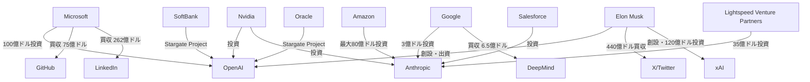

# 生成AI企業 関係性マップ

最終更新: 2025年1月29日

---

## 1. 投資・資本関係

### 主要投資関係図

### 詳細投資関係

#### Microsoft ⇔ OpenAI
- **2019年**: 10億ドル初回投資
- **2021年**: 追加投資（金額非公開）
- **2023年**: 100億ドル大型投資
- **2025年**: Stargate Projectで関係変化、独占的パートナーシップ見直し
- **関係性**: 従来の独占的パートナーシップから競合関係へ移行
- **条件**: Azure独占提供権利を失う

#### Google → Anthropic
- **2022年**: 3億ドル投資
- **2024年**: 追加投資で関係強化
- **関係性**: 戦略的投資、OpenAI対抗
- **条件**: Google Cloud優先利用

#### Amazon → Anthropic
- **2023年**: 最大40億ドル投資発表
- **2024年**: 80億ドル総投資完了
- **関係性**: AWS統合、OpenAI対抗の本格化
- **条件**: AWS Bedrock独占統合

#### xAI（Elon Musk）
- **2023年**: 創設、初期投資
- **2024年**: 60億ドル資金調達
- **2025年**: 100億ドル追加調達検討（750億ドル評価）
- **関係性**: 全AI企業との競合、反既存勢力
- **特徴**: X/Twitter データ独占アクセス

---

## 2. 最新評価額・企業価値（2025年1月時点）

### 主要企業評価額
| 企業 | 評価額 | 前年比 | 資金調達状況 |
|------|--------|--------|-------------|
| OpenAI | 3000億ドル（予定） | +88% | 400億ドル調達予定 |
| Anthropic | 615億ドル | +284% | 35億ドル調達完了 |
| xAI | 750億ドル | +875% | 100億ドル調達検討 |
| Cohere | 60億ドル | +1100% | 追加調達中 |
| Stability AI | 10億ドル | -50% | 資金調達困難 |

---

## 3. 協業・提携関係

### 技術提携

| 企業A | 企業B | 提携内容 | 開始年 | 状況 |
|-------|-------|----------|--------|------|
| Microsoft | OpenAI | Azure独占提供 | 2019 | 2025年変更 |
| Google | Anthropic | Cloud統合 | 2022 | 継続中 |
| Amazon | Anthropic | Bedrock統合 | 2023 | 継続中 |
| Apple | OpenAI | Siri統合検討 | 2024 | 交渉中 |
| Meta | Microsoft | Llama商用化 | 2023 | 継続中 |
| **SoftBank** | **OpenAI** | **Stargate Project** | **2025** | **新規** |
| **Oracle** | **OpenAI** | **Stargate Project** | **2025** | **新規** |

### 新たな戦略的提携

#### Stargate Project（2025年1月発表）
- **参加企業**: OpenAI、SoftBank、Oracle
- **投資規模**: 5000億ドル（4年間）
- **目的**: 米国AI インフラ構築、中国対抗
- **影響**: Microsoft依存からの脱却、新たな競争軸

### 研究協力
- **Google ⇔ 学術機関**: 多数の共同研究
- **Microsoft ⇔ 大学**: AI研究支援プログラム
- **OpenAI ⇔ 研究機関**: 安全性研究協力
- **Anthropic ⇔ 大学**: Constitutional AI研究
- **xAI ⇔ X/Twitter**: リアルタイムデータ活用研究

---

## 4. 競合・対立関係

### 直接競合

#### OpenAI vs xAI（新たな対立軸）
- **市場**: 対話AI、次世代AI開発
- **製品**: ChatGPT vs Grok 3
- **差別化**: 既存路線 vs 反既存勢力
- **特徴**: Grok 3「地球最高のAI」宣言

#### OpenAI vs Google
- **市場**: 対話AI、API市場
- **製品**: ChatGPT/GPT-5 vs Bard/Gemini 2.0
- **差別化**: AGI志向 vs 統合戦略

#### Microsoft vs OpenAI（新たな競合関係）
- **市場**: エンタープライズAI
- **製品**: Copilot vs ChatGPT
- **変化**: 提携から競合へ転換（2025年）

#### Anthropic vs OpenAI
- **市場**: 安全なAI、API市場
- **製品**: Claude vs ChatGPT
- **差別化**: 安全性重視 vs 性能重視
- **投資**: Amazon vs Microsoft-Oracle連合

### 間接競合
- **xAI vs 全社**: 反既存AI企業の立場
- **中国企業（DeepSeek等） vs 米国企業**: 地政学的競争激化
- **Meta vs 全社**: オープンソース戦略
- **Stargate連合 vs 中国AI**: 国家レベルの競争

---

## 5. 法的係争・訴訟

### 進行中の主要訴訟

#### OpenAI関連訴訟
1. **Elon Musk vs OpenAI** (2024年継続)
   - **争点**: 非営利から営利への転換
   - **主張**: 創設時の約束違反
   - **現状**: 係争中、xAI創設との関連

2. **著作権侵害集団訴訟**
   - **原告**: 作家・出版社グループ
   - **争点**: 無断学習データ使用
   - **現状**: 複数件係争中

3. **New York Times vs OpenAI** (2024年継続)
   - **争点**: 記事コンテンツ無断使用
   - **影響**: 業界全体への波及

#### Anthropic関連訴訟
1. **フェアユース訴訟** (2024年継続)
   - **争点**: 学習データのフェアユース適用
   - **重要性**: 業界全体への影響
   - **Anthropicの立場**: フェアユース主張

#### xAI関連法的課題
1. **データ使用権限**
   - **争点**: X/Twitterデータの商用利用
   - **懸念**: プライバシー保護
   - **現状**: 規制当局の監視下

### 著作権・知的財産権問題
- **学習データ**: 著作権保護コンテンツの無断使用
- **フェアユース**: 教育・研究目的の例外適用
- **国際的差異**: 各国の著作権法の違い
- **AI生成コンテンツ**: 知的財産権の帰属問題

---

## 6. 人材移動・引き抜き

### 主要人材移動

#### OpenAI関連
- **2023年**: Sam Altman一時解任→復帰騒動
- **2024年**: 主要研究者の大量離職
  - Ilya Sutskever（共同創設者）→ Safe Superintelligence Inc.
  - Mira Murati（CTO）→ 独立
  - Alec Radford（GPT開発者）→ 不明
- **流出先**: Anthropic、Google、Microsoft、新興企業

#### Anthropic創設・拡大
- **2021年**: 元OpenAI研究者による創設
- **2024年**: 人材獲得加速
- **主要メンバー**: Dario Amodei（元OpenAI VP）
- **技術継承**: Constitutional AI技術開発

#### xAI人材獲得
- **2023年**: 各社からの引き抜き開始
- **2024年**: 大規模採用計画
- **戦略**: 高額報酬での人材獲得
- **特徴**: 反既存勢力としての魅力

#### Google DeepMind統合
- **2023年**: DeepMind と Google AI統合
- **人材統合**: 重複排除と効率化
- **技術統合**: Gemini開発体制強化

### 人材獲得競争
- **年収水準**: AI研究者の年収高騰（年収3000万円〜）
- **ストックオプション**: 将来価値への期待
- **研究環境**: 最先端設備・データアクセス
- **自由度**: 研究テーマの選択自由
- **企業文化**: 各社の独自性重視

---

## 7. 規制・政府関係

### 米国政府との関係

#### OpenAI
- **NIST**: AI安全性ガイドライン協力
- **国防総省**: 軍事利用の議論
- **議会**: CEO証言・規制議論
- **Trump政権**: Stargate Project支援

#### Google
- **独占禁止法**: 司法省との係争継続
- **データプライバシー**: FTC調査
- **AI規制**: 業界標準策定参加

#### Microsoft
- **政府調達**: Azure政府契約
- **セキュリティ**: 国家安全保障協力
- **規制対応**: 積極的な政府対話
- **競合関係**: OpenAIとの提携見直し

#### xAI
- **規制回避**: 既存規制の隙間活用
- **政府関係**: Trump政権との距離
- **データ利用**: X/Twitterデータ活用の合法性

### 国際的な規制対応
- **EU AI Act**: 欧州での事業展開規制
- **中国規制**: 市場アクセス制限強化
- **日本**: AI戦略への参画
- **Frontier Model Forum**: 業界自主規制（Google、Microsoft、OpenAI、Anthropic）

---

## 8. 業界エコシステム

### チップ・インフラ依存
- **Nvidia**: 全社がGPUに依存、供給制約
- **クラウド**: AWS、Azure、GCP競争激化
- **データセンター**: 地理的分散の必要性
- **電力**: AI訓練の電力消費問題

### スタートアップ投資
- **OpenAI**: AI関連スタートアップ投資
- **Google Ventures**: AI分野への投資
- **Microsoft Ventures**: エコシステム構築
- **Anthropic**: 研究特化投資
- **xAI**: 独自エコシステム構築

### 学術界との関係
- **論文発表**: 研究成果の公開競争
- **人材交流**: 大学との人材交流
- **研究資金**: 大学研究室への支援
- **オープンソース**: 研究コードの公開戦略

---

## 9. 2025年の新たな動向

### 技術革新
- **GPT-5**: OpenAI次世代モデル開発中
- **Grok 3**: xAI「地球最高のAI」宣言
- **Gemini 2.0**: Google次世代モデル
- **Claude 3.5**: Anthropic継続改良

### 市場構造変化
- **Stargate Project**: 5000億ドル規模投資
- **Microsoft-OpenAI関係変化**: 独占から競合へ
- **中国AI台頭**: DeepSeek等の技術進歩
- **評価額バブル**: 異常な評価額上昇

### 地政学的影響
- **米中AI競争**: 技術覇権争い激化
- **Trump政権**: AI政策の方向転換
- **同盟国連携**: 技術同盟の形成
- **規制強化**: 各国でのAI規制法制化

---

## 10. 将来の関係性予測

### 統合・買収の可能性
- **規制強化**: 大型買収の困難化継続
- **技術統合**: 垂直統合の必要性
- **新興企業**: スタートアップ買収継続
- **xAI拡大**: 積極的な買収戦略

### 新たな対立軸
- **AI安全性**: 規制対応での対立
- **データアクセス**: 学習データ確保競争
- **国際展開**: 地政学的制約
- **技術標準**: 業界標準争い

### 協力の必要性
- **標準化**: 業界標準の策定
- **安全性**: 共通の安全基準
- **規制対応**: 政府との協調
- **環境対応**: 持続可能なAI開発

---

## 11. 分析サマリー

### 現在の関係性（2025年1月）
- **OpenAI**: Microsoft依存から脱却、新たな連合形成
- **Anthropic**: Amazon-Google支援で独立系最大手
- **xAI**: 反既存勢力として急成長
- **Microsoft**: 提携から競合へ転換
- **Google**: 独自路線と投資戦略継続

### 今後の注目点
- **Stargate Project**: 5000億ドル投資の実現性
- **xAI成長**: 「地球最高のAI」の実力
- **GPT-5発表**: 次世代AI競争の行方
- **規制強化**: 政府介入の拡大
- **中国AI**: DeepSeek等の技術追い上げ

### 市場への影響
- **投資環境**: 異常な評価額上昇
- **競争激化**: 技術・人材・資金の争奪戦
- **規制対応**: 各国での法制化進行
- **社会実装**: AI技術の社会浸透加速

---

*この関係性マップは企業動向と市場変化を反映して定期的に更新されます。最新更新: 2025年1月29日* 